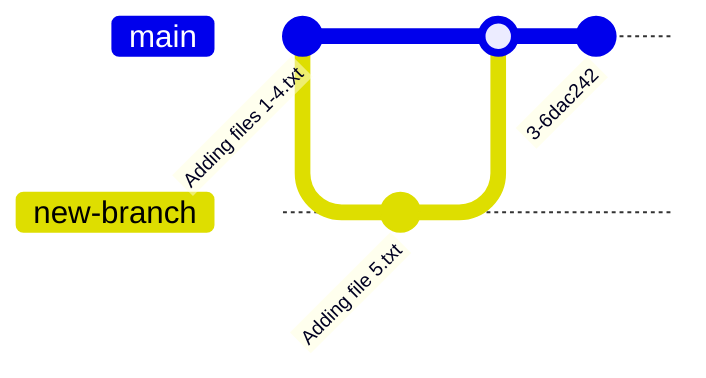

# May 4 2022
## ssh keys
* The default port for SSH is 22
* An SSH connection requires a key pair, commposed of a publiic key and a private key
## change a remote
```bash
git remote set-url <name> <url>
# e.g.
git remote set-url origin git@gitlab.com:michael-dez/k8s-cohort.git
```
## see remotes
```bash
git remote -v
```
## see branches
```bash
git branch
```
## new branch
```bash
git branch <new-branch>
# e.g.
git branch feature1
# or
git checkout -b <new-branch>
```
## change branches
```bash
git checkout <branch>
# e.g.
git checkout feature1
```
## demo

## merging branches
Commit changes on feature branch, push feature branch, and perform a merge request via gitlab.
```bash
git merge new-branch
```
## delete feature branch locally
```bash
git branch -d new-branch
```
## clone a repository
```bash
# without authentication
git clone <https-path>
```

