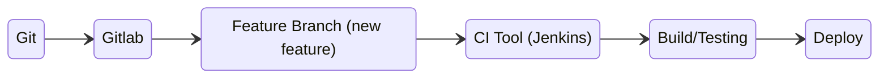

# May 5 2022
## Real World Workflow

## git stash
Add changes to staging area then use `git stash` to preserve state of changes. Unstash with `git stash pop`.
## git revert
Revert committed changes.
```bash
git revert <commit-id>
```
## git diff
Find the difference between two commit ids.
```bash
git diff <commit-id> <commit-id>
```
## git rebase
* This is an alternative to git merge command
* Should be used on local branches, since history does change and will be confusing for other team members
## merge conflicts
Occurs when git can't decide on which changes to apply to a file. Requires manual intervention.
## git cherry-pick
Apply the changes introduced by some existing commits.
```bash
# source: 
# https://git-scm.com/docs/git-cherry-pick
git cherry-pick [--edit] [-n] [-m <parent-number>] [-s] [-x] [--ff]
		  [-S[<keyid>]] <commit>…​
git cherry-pick (--continue | --skip | --abort | --quit)
```
