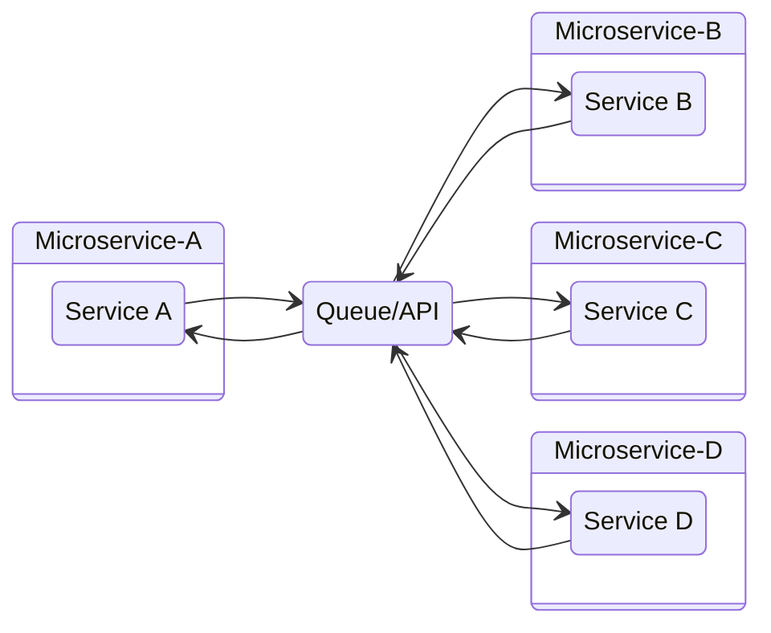

# May 9 2022
## Microservices
Microservices decouple an application to provide:
* greater security
* greater reliability
* easier maintenance
## Problems before Virtualization
* Buying servers was expensive
* Resources not being utilized at full potential
* Process of getting any software up and running was time consuming
* Disaster recovery was difficult
## Monolithic Application
A Monolithic application doesn't isolate services. Any changes to a single service affect the entire application.
```mermaid
stateDiagramv-2
Application {
sa : Service A
sb : Service B
sc : Service C
sd : Service D
}
```
## Microservice Application
Decouples services.

## Docker Commands
`docker --version`: show version
`docker ps`: list all running containers
`sudo docker exec -it <container_id> <shell>`: start an interactive shell in container
`sudo docker stop <container_id>`: stop a container
`sudo docker rmi <image_name>`: remove an image
`sudo docker ps -a`: list all containers
`sudo docker rm <container_id>`: remove a container
`sudo docker iamges`: list all images
