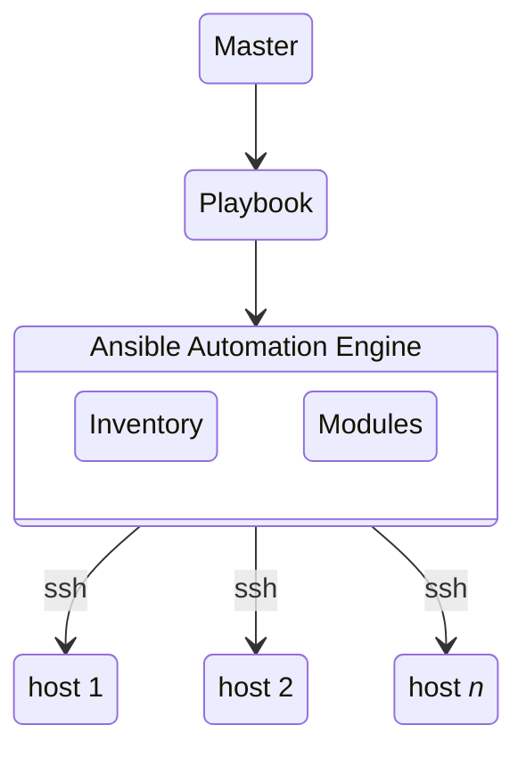

# May 11 2022
# Docker
## `docker info` command
This command displays system wide information regarding the Docker installation. Information displayed includes the kernel version, number of containers and images.
## `var/lib/docker`
The directory containing docker data.
```bash
ls -lrt /var/lib/docker
output:
drwx--x--x  3 root root 4096 May 10 19:43 containerd
drwx------  4 root root 4096 May 10 19:43 plugins
drwx------  3 root root 4096 May 10 19:43 image
drwx------  2 root root 4096 May 10 19:43 trust
drwxr-x---  3 root root 4096 May 10 19:43 network
drwx------  2 root root 4096 May 10 19:43 swarm
drwx--x--x  4 root root 4096 May 10 19:43 buildkit
drwx------  2 root root 4096 May 10 20:58 runtimes
drwx-----x  3 root root 4096 May 10 20:58 volumes
drwx------  2 root root 4096 May 10 21:25 tmp
drwx--x--- 24 root root 4096 May 10 21:26 overlay2
drwx--x---  2 root root 4096 May 10 21:26 containers
```
## volumes and bind mounts
**bind mount** attaches an existing directory/file to the container
**volume** attaches a docker volume to the container
```bash
# e.g.
docker run -itd --name devtest --mount source=myvol2,target=/app nginx:latest
```
### list volumes
```bash
docker volume ls
```
### inspect a volume
```bash
docker volume inspect <volume_name>
```
# Ansible
## What is Ansible
* Ansible is an open-source configuration management tool
* can solve a wide range of automation challenges
* In 2015 Red Hat Aquired Ansible
## Advantages
* Easy to learn
* Written in Python
* Easy installation and configuration
* Agentless
## How does Ansible work?
* Work is organized into **playbooks**
## Ansible Architecture

**Playbook** describes the tasks to be performed
**Inventories** List of hosts
**Modules** Tools written in Python that allow interaction with different resources
## Other Ansible Tools
* **Ansible** cli tool
* **Ansible Tower** gui (licensed)
* **AWX** (licensed)
## Installing Ansible on Amazon Linux 2
* requires package `amazon-linux-extras`
```bash
sudo amazon-linux-extras install -y epel
sudo yum install -y ansible
```
## What is a Playbook
* A playbook is composed of **plays** that contain **tasks** which call core or custom **modules**
