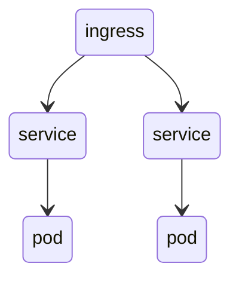

# May 18 2022
## installation options
- kubeadm
- kops
- kubespray
- kubernetes the hard way
## managed services
- EKS - AWS solution
- AKS - Azure soution
- GKE - GCP solution
- Openshift - Redhat

- Minikube - learning & development
## swarm vs k8s
|swarm | k8s|
|easy to install|complex installation|
TODO
## architecture
```mermaid
m : master node
w1 : worker node 1
w2 : worker node 2
w3 : worker node 3
m --> w1
m --> w2
m --> w3
```
* interact with k8s using cli (`kubectl`) or ui.
## master components
**etcd** - key value store accessible via api
**api server** - front end for the control plane. exposes k8s api.
**scheduler** - allocates tasks to nodes.
**controller manager** - runs all the controllers on the cluster. although each controller is a separate process, they are combined into a single process.
**kubelet** - creates pods for each node and monitors the health of the node.
**kube proxy** - manages communication between nodes.
## resources
**pods** can have one or more containers coupled together. They are the basic unit of Kubernetes.
**services** are used to load balance the traffic among the pods.
**ingress** is an object that allows access to your k8s services from outside the cluster.

## Pod
