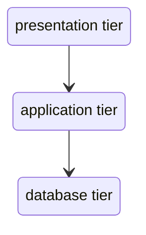

# May 23 2022
## services
* An abstract way to expose an application running on a set of Pods as a network service
* A Service in Kubernetes is a REST object, similar to a Pod
A service always enabled its network access to a pod or set of pods
* Services will select the **pods based on their labels** and when a network is made to those services it selects all Pods in the cluster matching the **service's selector** and will choose one of them, and then will **forward the network request to it**
## why are services needed?
* In order to access the application over the network, we must use kubernetes service to expose our pods to external traffic and load balancing the traffic across multiple pods
## types of services
* ClusterIP (default) - exposes the service on an internal ip in the cluster.
* NodePort - exposes the service on the same port of each selected Node in the cluster using NAT.
* LoadBalancer - creates an external load balancer in the current cloud(if supported) and assigns a fixed, external IP to the service
* ExternalName - assigns an arbitrary CNAME record to the service
## three tier application

The different application tiers can be logically divided into services.
