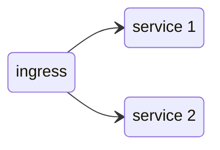

# May 26 2022
## What is Ingress
Kubernetes ignress is a collection of routing rules that govern how external users access services running in a Kubernetes cluster.

```mermaid
stateDiagram-v2
direction LR
i : ingress
s : service 1
s2 : service 2
i --> s
i --> s2
```

