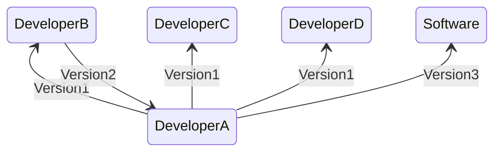
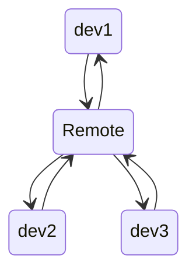
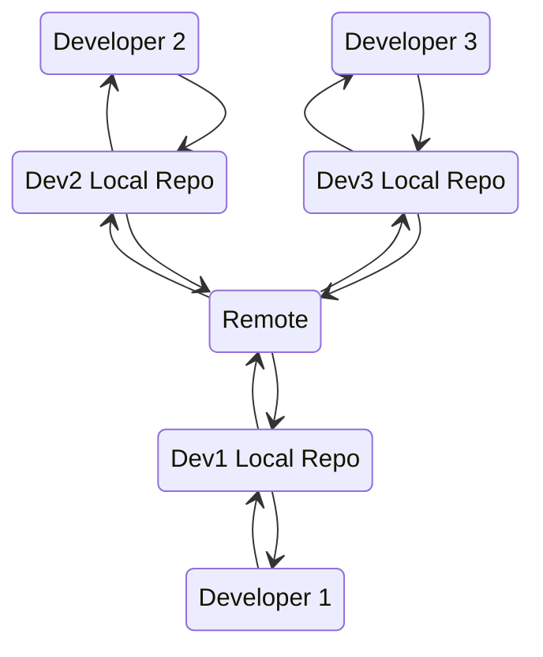
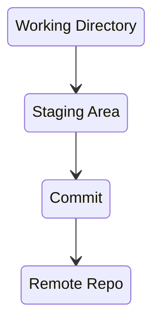

# May 3 2022
## What is Version Control
Version control is a system that records/manages changes to documents, ocmputer programs etc over time. It helps us tracking changes when multiple people work on the same project.
## Problems before Version Control
* Versioning was manual.
* Team Collaboration was a time consuming task
* 

## Advantages of Version Control
* Versioning is automatic
* team collaboration is simple
* easy access to previous versions
* only modified code is stored across different versions, hence saves storage
## Types of Version Control
### Centralized Version Control System

* Needs constant internet connection
* Number of commits won't affect performance
### Distributed Version Control System

* Committing and retrieving action is faster since data is on local drive
* Not good for storing large files which are binary in nature, this would increase the repo size at every commit
* If a project has a lot of commits, downloading them may take a lot of time
## What is SVN?
* Needs constant internet connection
* Slower than DVCS
## What is Git?
Git is a version-control systemm for tracking changes in computer files and coordinating work on those files among multiple people. It is primarily used for source-code management in software development.
## Git Lifecycle

## How Git works
* All commits are bound to a branch
* Master branch contains production code
## Our GitLab Directory Hierarchy
AWS
Bash
Ansible
Docker
K8S
Packer
...
## Configure Repo for GitLab Remote on Amazon Linux 2
For a repo already initialized with `git init`.
```bash
git remote add origin git@gitlab.com:michael-dez/gitdemo.git
ssh-keygen -t ed25519 -C "MikeM@marsreturnship.com"
# Accept default key name of id_ed25519
# Press enter for blank passphrase or type a passphrase and press enter
cat ~/.ssh/id_ed25519.pub
```
## Copy public key to gitlab.
* copy the output from the previous command
* Go to settings in upper right > **Preferences** > **SSH Keys**
* Paste the public key in the **Key** field
* select a title (expiration is optional) and **Add key**
## Push
```bash
git push --set-upstream origin master
```
See [gitlab docs](https://docs.gitlab.com/ee/user/project/repository/mirror/index.html) for mirroring with Github.
